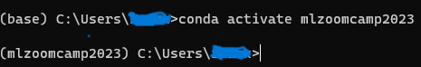

# Notes

### Set Up the Environments

You can access a cheat sheet for Anaconda by visiting [this link](https://docs.conda.io/projects/conda/en/4.6.0/_downloads/52a95608c49671267e40c689e0bc00ca/conda-cheatsheet.pdf)

To begin, we will create an environment named ``mlzoomcamp2023`` and install python 3.10. Ensure that Anaconda is already installed on your system. Open your terminal and execute the following commands:

```bash
conda create --name mlzoomcamp2023 python=3.10
```

Next, activate the environment to use it:

```bash
conda activate mlzoomcamp2023
```



You have two options for installing the required libraries; using ``pip install`` or ``conda install``.

Using ``pip install``

```bash
pip install numpy pandas scikit-learn seaborn
```

Using ``conda install``

```bash
conda install numpy pandas scikit-learn seaborn
```

### Downloading files

You can download files using either ``wget`` or ``curl``. Here's how to do it with both methods:

Using ``wget``

```bash
wget https://raw.githubusercontent.com/alexeygrigorev/datasets/master/housing.csv
```

Using ``curl``

```bash
curl https://raw.githubusercontent.com/alexeygrigorev/datasets/master/housing.csv --output housing.csv
```

For additional ``curl`` commands and options, you can refer to [this link](https://www.cyberciti.biz/faq/download-a-file-with-curl-on-linux-unix-command-line/)

### Calculate Average/Mean Using Numpy

To calculate the average or mean of a column in a dataframe, you can use different functions from the numpy library depending on whether the column contains missing value or not.

If the column does not have any missing values, you can use ``np.averge`` to compute the arithmetic mean of the values. This function takes the column as an argument and returns a single number.

However, if the column has some missing values, denoted by ``np.nan``, then using ``np.average`` will result in `nan` values as well. This is because `np.average` does not ignore the missing values when calculating the mean. In this case, you can use ``np.nanmean`` instead, which will drop the missing values before computing the mean. 

You can check about ``np.nanmean`` from [this link](https://sparkbyexamples.com/numpy/numpy-nanmean-mean-ignoring-nan-values/)


